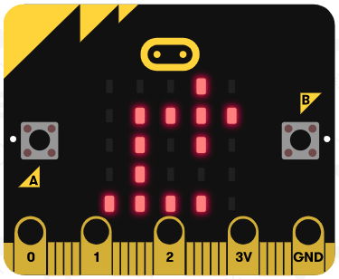

# Microbit Komoot Navigator

This is a Komoot connect navigator running on the bbc micro:bit (nRF51822). It uses bluetooth low energy to listen for the Komoot navigation service and display navigation instructions without using GPS.

I am not experienced in C++, BLE or embedded projects, so there are probably better ways to do everything here, however, this is the only working example I can find of flashing the softdevice s130 onto the microbit, which allows it to act as a central (client) rather than a peripheral (server).

As this program uses the s130 softdevice, there is even less memory available than usual, so the micro:bit runtime does not work.

Hopefully if you read this readme you can flash the s130 softdevice onto your micro:bit, or modify this example to create your own GATT client. In theory, this code should also work on any nRF51822 without the micro:bit display.

# Hardware

Micro Bit (Widely available) (about £13)

Micro Bit Battery holder (about £4)

The code is written for the nRF51822 so should work on any board based on that. You can rewrite the `onKomootData` function to output to your own display.

# Display

While navigating the microbit shows an arrow on the top 4 rows indicating where to go next, and a bar along the bottom which tells you when to turn.
| LEDs | Distance |
| --- | --- |
| 1 LED | < 100m |
| 2 LEDs | < 50m |
| 3 LEDs | < 30m |
| 4 LEDs | < 20m |
| 5 LEDs | < 10m |



This means go right in less than 20m.

# How to use

It has been tested to work on android only, however iOS should follow simular steps.

1. Head to [releases](https://github.com/fishfred/microbit-komoot-navigator/releases) and flash `microbit-komoot-pair.hex` onto your microbit by dragging and dropping. This is the program we will use to pair with your phone.
2. A bluetooth logo should appear on the screen. This means it's ready to pair.
3. Go to bluetooth settings on your device, pair new device and select Microbit Navigator.
4. Your phone should pair without having to enter a code.
5. Go to [releases](https://github.com/fishfred/microbit-komoot-navigator/releases) and flash `microbit-komoot-navigator.hex` onto your microbit by dragging and dropping. This is the program that acts as the navigator.
6. The micro:bit's top left LED should start flashing. This means it's scanning for the Komoot connect service.
7. Go to the Komoot app, tap on profile, then settings. Under `connections`, tap Bluetooth Connect.
8. A list of devices will appear. Select any one.
9. Microbit Navigator will then appear in the list and you can connect to it.
10. Now whenever you start navigation the Komoot app will start advertising it's BLE service. The micro:bit should connect automatically.

# Differences to a standard micro:bit program

Most micro:bit programs are written in the makecode IDE, or something like micropython. There are several issues with these approaches.

## Why not micropython or makecode?

Micropython seems like a great choice, however there is not enough space on the micro:bit for both the bluetooth stack and the micropython interpreter. So BLE is not supported at all.

Makecode does have enough extra space to access the bluetooth stack. However it is built on top of the micro:bit runtime

## Micro:bit Runtime


The one thing all these things have in common is that they're built on top of the microbit runtime. The microbit runtime is an abstraction of the ARM mBed SDK, which is built on the Nordic nrf51 SDK.

According to the micro:bit [runtime website](https://lancaster-university.github.io/microbit-docs/ble/profile/) 'The profile consists of "services" and "characteristics"'. We do not want to create a service and characteristics, we want to be on the other end, listening for services and reading characteristics. This is called a GATT client.

## SoftDevices
### s110
It turns out the micro:bit runtime uses the s110 softdevice. A softdevice is firmware written by Nordic Semiconductor which acts as the bluetooth stack. It is the layer underneath the nrf51-sdk in the diagram. The s110 decice can only act as a Peripheral or Broadcaster, it cannot scan or connect to other peripherals.

It turns out there is another SoftDevice compatible:

### s130
The s130 softdevice supports being a Central or a Peripheral, which is what the program needs. It takes up a lot of memory, which means we can no longer use the micro:bit runtime. Instead, we will have to use the mBed SDK.

It took me a few days to actually load the s130 softdevice onto the micro:bit. The only toolchain I found which works was [yotta](https://lancaster-university.github.io/microbit-docs/offline-toolchains/), using the target `bbc-microbit-classic-gcc-s130`.

## Libraries

I'm using the lancaster-university forks of ble and ble-nrf51822 (BLE_API and nRF51822 on mBed) with the latest version of microbit and microbit-dal, which I'm using to drive the micro:bit display.

There isn't much documentation anywhere on the GATT client functionality of the BLE_API library. This is because it is used for ARM mBed 2 which is deprecated, so ARM has unlisted all the examples. There is also not much documentation online anyway. [Here](https://os.mbed.com/teams/Bluetooth-Low-Energy/code/BLE_ButtonSense//file/2dec89c76f68/main.cpp/) is the only example for mBed 2 which uses GATT client. Luckily the code itself is quite nicely documented.


# How to build

## Yotta (Recommended)
I built the program on Windows using the [yotta](https://lancaster-university.github.io/microbit-docs/offline-toolchains/). This is the only toolchain I could find which supported the s130 softdevice.

I used Visual Studio Code to write the program. Intellisense works as long as you tell vscode where to look for includes, and specify your compiler (I might add the configuration files at a later date).

These are the versions I downloaded of all the software. If compilation doesn't work for you, try these versions

* [GCC 4.9.3 (arm-none-eabi-gcc)](https://launchpad.net/gcc-arm-embedded/4.9/4.9-2015-q2-update/+download/gcc-arm-none-eabi-4_9-2015q2-20150609-win32.exe)
* Python 2.7
* CMake 3.17.3

1. Clone the repository and navigate into it's directory
```
git clone https://github.com/fishfred/microbit-komoot-navigator
cd microbit-komoot-navigator
```
2. Install the yotta targets
```
yt target bbc-microbit-class-gcc-s130
```
3. **IMPORTANT:** in `yotta_targets/bbc-microbit-classic-gcc-s130/CMake/toolchain.cmake` change line 22 from 
```
set(CMAKE_EXE_LINKER_FLAGS_INIT    "${CMAKE_EXE_LINKER_FLAGS_INIT} -mcpu=cortex-m0 -mthumb -T\"${CMAKE_CURRENT_LIST_DIR}/../ld/NRF51822.ld\"")
```
to
```
set(CMAKE_EXE_LINKER_FLAGS_INIT    "${CMAKE_EXE_LINKER_FLAGS_INIT} -mcpu=cortex-m0 -mthumb -T\"${CMAKE_CURRENT_LIST_DIR}/../ld/NRF51822_S130.ld\"")
```
4. Change the `#define` statements

If you undefine `DISPLAY_ENABLE` (line 14) then the display will not work, but you will get serial debug output (from the printf statements). There is not enough memory for these both to run.

If you define `PAIR_MODE` the output file will be the pairing program, used to pair with a phone.

5. Compile. This should download all the dependencies.

```
yt build
```

The output is in `build/microbit-komoot/microbit-komooot-combined.hex`

### Serial

I recommend using serial to debug. This is enabled by undefining `DISPLAY_ENABLE` (line 14). The serial output is 115200 baud.

## Notes

### ARM mBed online compiler
You *cannot* use the ARM mBed online compiler as it does not support the microbit with the s130 softdevice. (`NRF51_MICROBIT_B`). Setting `NRF51822` as the target does not work either.

### ARM mBed CLI
The ARM mBed CLI should work using the `NRF51_MICROBIT_B` target, however the project is very buggy and seems to be abandoned. I tried to get it to work there for a couple of days without any success.

### ARM mBed IDE
I don't think the mBed IDE supports mBed OS 2.

# Images

The arrow icons are defined in `images.h`. They are stored in flash to save memory.

Check out [this guide](https://lancaster-university.github.io/microbit-docs/data-types/image/#storing-images-in-flash-memory) for more information

# Resources

nRF51822 https://www.nordicsemi.com/Products/Low-power-short-range-wireless/nRF51822

s130 https://www.nordicsemi.com/Software-and-tools/Software/S130

MicroBit Runtime https://lancaster-university.github.io/microbit-docs/

yotta http://docs.yottabuild.org/

Komoot Connect https://www.komoot.com/b2b/connect#bleconnect

Komoot Connect Documentation https://docs.google.com/document/d/1iYgV4lDKG8LdCuYwzTXpt3FLO_kaoJGGWzai8yehv6g

BLE_API mbed https://os.mbed.com/teams/Bluetooth-Low-Energy/code/BLE_API/docs/tip/